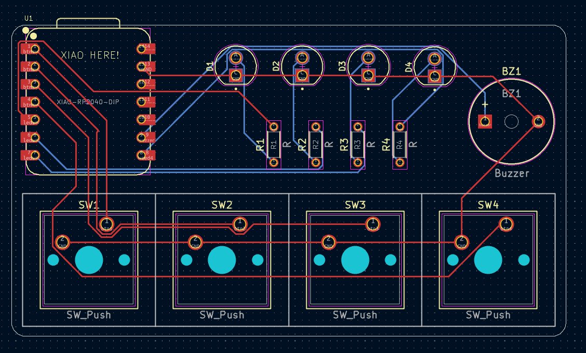

# XIAO TIMER

basically, a little pcb timer i made to help me keep track of time

### features

- leds light up in order to show the time elapsed
- all leds light up + buzzer beeps when the time is up
- some easter eggs here and there!
- you can set timer for diff times depending on the number of button clicks or press type:

<table>
<tr>
<th>Button Number</th>
<th>Short Press</th>
<th>Long Press</th>
</tr>

<tr>
<td>1</td>
<td>30 seconds</td>
<td>15 minutes</td>
</tr>

<tr>
<td>2</td>
<td>1 minute</td>
<td>30 minutes</td>
</tr>

<tr>
<td>3</td>
<td>5 minutes</td>
<td>1 hour</td>
</tr>

<tr>
<td>4</td>
<td>10 minutes</td>
<td>2 hours</td>
</tr>

</table>

### pcb

the pcb was designed in kicad
#### schematic:

#### the pcb:

### components used

- XIAO RP2040  
- 4 LEDs  
- 4 Cherry MX Switches  
- A buzzer  
